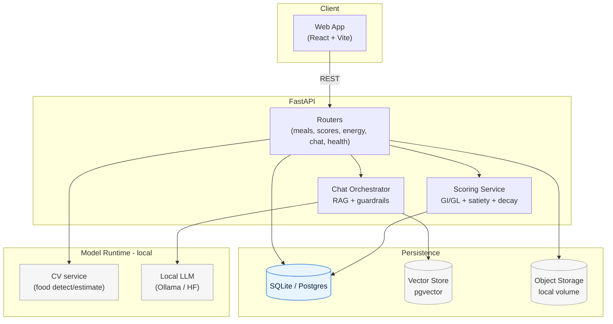

# System Architecture - LettyQuest

This directory holds the architectural design for LettyQuest (BugsByte Hackathon 2026).

What to keep here:
- High-level diagrams: frontend ↔ FastAPI ↔ storage/DB; data flow for meal logging → scoring → energy bar; chatbot/RAG flow (local LLM via Ollama/HF).
- API contracts: endpoints, request/response schemas (meals, scores, energy, chat, health).
- Data model: users, profiles, meals, meal_items, scores, streaks, reminders, chat sessions/messages.
- Scoring logic: GI/GL and satiety-based formulas, energy decay over time, mood thresholds (happy/neutral/wilted).
- Deployment notes: local docker-compose (API + DB, optional vector store, optional Ollama/HF container), ports, env vars.

Current infra helpers:
- docker-compose (root) runs FastAPI + SQLite with data persisted under `DEV/app/backend/data`.
- Frontend scaffold: React + Vite + Tailwind under `DEV/app/frontend`, consuming the REST API.
 - Frontend container available via docker-compose (served on http://localhost:4173; build arg `VITE_API_BASE_URL` defaults to http://api:8000/api/v1).

Start with lightweight markdown diagrams and schema snippets so the dev team can wire endpoints quickly during the hackathon.

### API skeleton (implemented)
- Health: `GET /api/v1/health`
- Meals: `POST /api/v1/meals`, `GET /api/v1/meals`
- Scores: `POST /api/v1/scores` (ad-hoc scoring)
- Energy: `GET /api/v1/energy` (decay over time from last score)
- Chat: `POST /api/v1/chat` (stub; to be backed by local LLM via Ollama/HF and RAG)
	- Implemented via `llm.py` adapter stub (local model name via `LLM_MODEL` env); guardrails embedded in prompt.

## High-Level Architecture (Mermaid)

